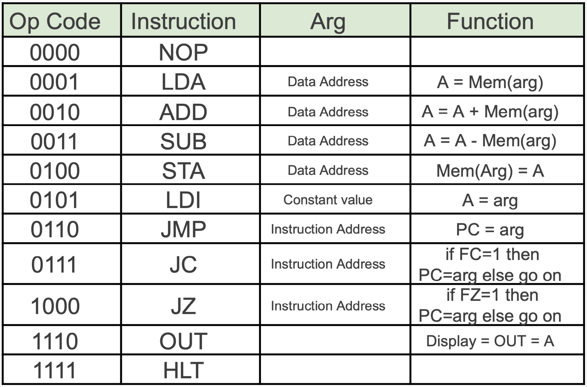

# SAPsim

> Simulation of [SAP (Simple As Possible) computer](img/SAP.png) programs from COMP311 (Computer Organization) @ [UNC](https://unc.edu)


Write a SAP program in the format given in [`template.csv`](template.csv). Also see [`example.csv`](tests/public_prog/example.csv) ([output full speed](tests/data/public_prog/example_full_speed.txt)) ([output debug mode](tests/data/public_prog/example_debug.txt)).

You may edit the `.csv` files in Microsoft Excel. Pass the path to your SAP program as a CLI argument. It'll then be run in debug mode (default). Alternatively, apply the `-s` option to run at full <ins>s</ins>peed.

First, make sure your terminal says you're in the `SAPsim/` directory. The current working directory needs to be `.../SAPsim`.

Make sure you're running Python 3.7+ with `python3 --version`.

Then, type `python3 -m pip install -r requirements.txt`.

```
usage: python3 -m sim [-h] [-s] [-c CHANGE] [-f FORMAT] [-b BITS] prog

positional arguments:
  prog                  path to SAP program in the format given in template.csv

options:
  -h, --help            show this help message and exit
  -s, --speed           run at full speed
  -c CHANGE, --change CHANGE
                        before execution, overwrite data at mapped address(es) to base-10 value(s)
                        format is <addr>:<base-10 value>,<addr>:<base-10 value>,...
  -f FORMAT, --format FORMAT
                        print format, options: https://github.com/astanin/python-tabulate#table-format
                        modify default value in src/utils/globs.py
  -b BITS, --bits BITS  number of bits in the unsigned registers (default is 8)
```

This program passes all my unit tests (many omitted here) on `[3.7, 3.8, 3.9, 3.10]` X `[ubuntu-latest, windows-latest]`. I test locally on macOS (M1) with Python 3.10, so that works too.

If you run into `ModuleNotFoundError: No module named 'src'`, make sure your current working directory is `.../SAPsim`!



## General rules for SAP programs

- All SAP programs should fit in 16 addresses (0 to 15) because the program counter (`PC`) is 4-bit.
- Initial values are `{PC: 0, Register A: 0, Register B: 0, FlagC: 0, FlagZ: 0, num_bits_in_registers: 8, Executing: 1}`.
- `A` and `B` registers are unsigned and 8-bit by default. Number of bits is configurable via the `-b BITS` CLI option.
- Any value at a memory address is a byte.
  - An instruction is a Mnemonic representing an Opcode (4-bit) and an Arg (4-bit).
    - For an instruction, the Arg can be represented in base-10 or base-16.
      - For example, `JC 15` can be written as Mnemonic `JC`, Arg `15` or Mnemonic `JC`, Arg `F`.
  - All data must fit in a byte. Specifically, the Mnemonic is a hexit, and the Arg is a hexit.
    - For example, 254 = `0xFE` is Mnemonic `F`, Arg `E`.
    - 10 = `0x0A` is Mnemonic `0`, Arg `A`. You may not omit the leading 0.
- Programs run until they `HLT` or until an [`Exception`](src/utils/exceptions.py) is raised. Infinite loops are possible, of course.
- These are the same rules a SAP computer implemented by hardware has to follow.
  - > "This is a feature, not a bug"

## Parsing rules

### Allowed syntax

In the Mnemonic column, these are allowed

- two or three letter Mnemonic (for an instruction)
- single-digit hexit `0` to `F` (for data)

In the Arg column, these are allowed

- single-digit hexit `0` to `F` (for instruction or data)
- double-digit base-10 integer `10` to `15` representing a hexit
  - e.g. `JC 15` and `JC F` are both legal and represent the same instruction

### How to get a parsing `Exception`

- No `Address` in a row
- Completely blank row
- An `Address` in a row with a `Mnemonic` XOR `Arg` (i.e., missing just one)
- Duplicate `Address`es
- 4-bit Opcode in a `Mnemonic` field
- Mnemonic (if field is numerical) or Arg doesn't fit in a hexit

## [`Exceptions`](src/utils/exceptions.py)

- See the link in the heading for a list of custom `Exceptions`. The names are self-explanatory.
- Each Exception also prints a descriptive error message.
